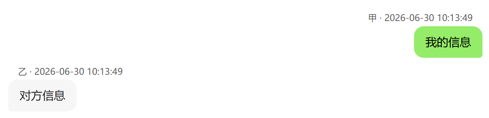
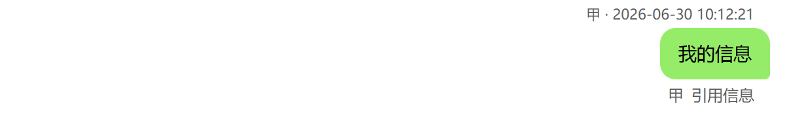
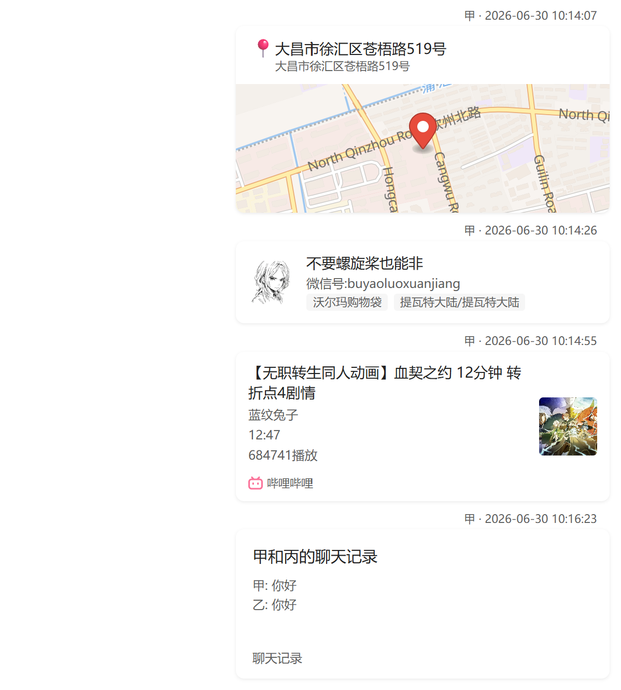
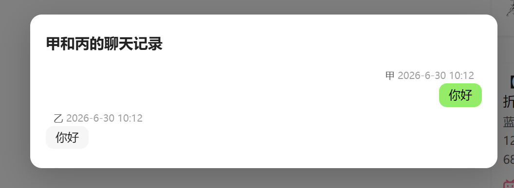
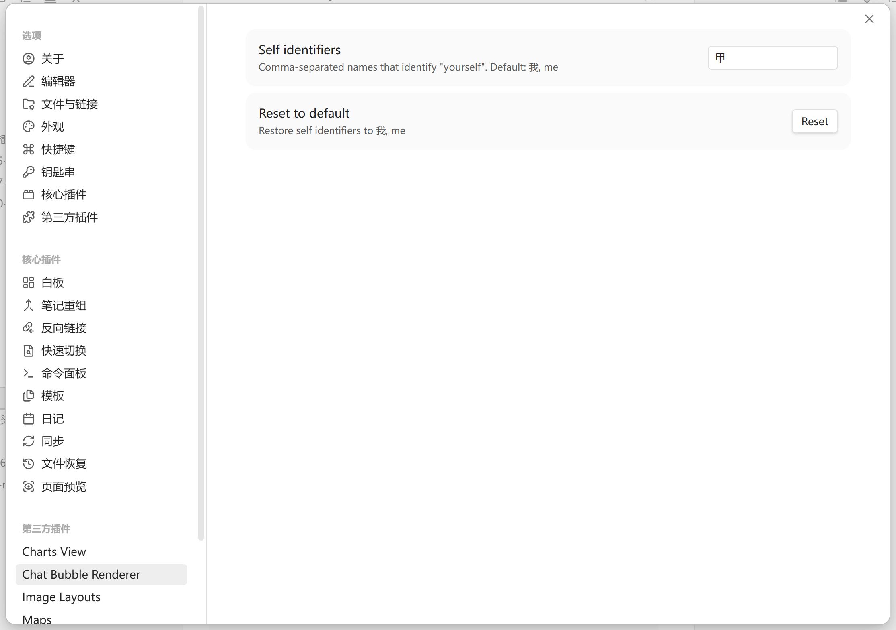

# Chat Bubble Renderer

> Instantly transform Markdown chat logs into WeChat-style bubble dialogs inside Obsidian.

[](https://github.com/bruce2431/obsidian-chat-bubble-renderer/releases)
[](LICENSE)

## Features

### Automatic Rendering

Switch to reading view on any file tagged with `#聊天记录` — bubbles appear automatically. No manual trigger needed. Press `Esc` to dismiss. A `Ctrl+P` command ("Render as Chat Bubbles") is also available for manual control.

### Message Types

| Type | Description |
|------|-------------|
| **Text** | Standard messages in WeChat-style bubbles: others on the left (gray `#f2f3f5`), yourself on the right (green `#95ec69`). Bubbles auto-size to content width. |
| **Quote Reply** | `>[Sender] quoted content` — renders a gray reference bar above the reply bubble. Supports quoted images (thumbnail), videos (first-frame preview), audio (inline toggle), PDFs (red badge), and location/card/link previews. |
| **Merge-Forward** | `[合并转发\|title]` — a compact card showing title + 4-line preview + "Chat Records" footer. Click to open a navigable overlay with sender/timestamp bubbles, inline media, and support for **unlimited nesting** (click nested cards to dive deeper, click background to pop back). |
| **System Messages** | Nudge, recall, group creation/rename, friend verification — rendered as centered gray tips without bubbles. |

### Rich Cards

| Card | Format | Behavior |
|------|--------|----------|
| **Location** | `[位置\|address\|city\|lng,lat]` | MapLibre vector map preview with red pin marker. Click to open in OpenStreetMap. |
| **Contact** | `[名片\|nickname\|wechat_id\|sex\|region]` | Avatar (from `![[image]]` on next line) + nickname + tags. Personal 名片 shown as 👤, official accounts as 📢. |
| **Link** | `[链接\|title\|cover_url\|description](url)` | Rich preview card with platform badge (Bilibili, NetEase Music, Xiaohongshu, WeChat, QQ, LOFTER, Tencent Meeting — auto-detected by domain) + cover thumbnail on the right. Simple cards fall back to a 🔗 icon. Supports `[小程序\|...]` variant. |
| **File** | `![[file.pdf]]` | Card with filename + extension badge (colored red). PDFs open an iframe preview on click. Supports PDF/DOC/DOCX/XLS/XLSX/PPT/PPTX/TXT/ZIP/RAR/7Z. |

### Media Support

- **Images** — Inline rendering with `loading="lazy"`. Click to preview full-size in a dark overlay modal.
- **Videos** — Static preview card (200×280 + first-frame thumbnail + ▶ overlay). Click to play full-screen.
- **Audio** — WeChat-style voice bubble (🔊 icon + dynamic duration). Click to play/pause inline.
- All media resolved via Obsidian's vault resource paths — audio files are base64-encoded for playback.

### Performance

- **Virtual scrolling** — Only ~150 DOM nodes visible at any time, even with tens of thousands of messages.
- **Lazy media resolution** — Media file URIs are resolved on-demand as messages scroll into view.
- **Chunked base64 encoding** — Large audio files encoded in 4096-byte chunks, ~40× faster.
- **Event-driven auto-render** — No polling; renders on tab switch and layout change via workspace events.
- **Shared name map** — Vault file lookups cached once and kept in sync via create/delete/rename events.

### Theme & UX

- Follows Obsidian's light/dark theme automatically via CSS custom properties.
- All interactive elements use event delegation (no inline `onclick`) — clean, secure, maintainable.
- Overlay modals close on background click or `Esc` key.
- `safeHrefAttr` protocol filtering on all user-generated links (`http`/`https`/`mailto`/`obsidian` only).

## Chat Log Format

### Basic Message

```markdown
---
tags:
  - 聊天记录
---

[Sender Name] 2026-06-30 10:13:49
Message content here.
[Reciver Name] 2026-06-30 10:13:49
Message content here.
```



### Quote Reply

```markdown
[甲] 2026-06-30 10:12:21
> [甲] Quoted message text
My reply content.
```



Quotes also support media and card references:
```markdown
> [甲] ![[image.jpg]]         — thumbnail preview
> [甲] [位置|Shanghai|上海|121.47,31.23]  — map thumbnail
> [甲] [名片|张三|wxid_xxx|男|北京]        — contact card preview
> [甲] [链接|Title|cover.jpg](https://...)  — link card preview
```

### Rich Cards

```markdown
[甲] 2026-06-30 10:14:07
[位置|详细地址|市|经度,纬度]

[甲] 2026-06-30 10:14:26
[名片|Name|微信号:wxid|Gender|Location]
![[avatar.jpg]]

[甲] 2026-06-30 10:14:55
[链接|标题|https://example.com/cover.jpg|其它信息](https://example.com/article)

[甲] 2026-06-30 10:16:23
[合并转发|甲 和 丙的聊天记录]
  甲 2026-6-30 10:12
  你好
  丙 2026-6-30 10:12
  你好
```





### Media Embeds

```markdown
[甲] 2026-06-30 10:13:49
![[photo.jpg]]

[甲] 2026-06-30 10:14:00
![[voice.amr]]

[甲] 2026-06-30 10:14:30
![[video.mp4]]

[甲] 2026-06-30 10:15:00
![[document.pdf]]
```

## Installation

### Community Plugin Store

Search **"Chat Bubble Renderer"** in Obsidian → Settings → Community plugins → Browse → Install.

### Manual

```bash
git clone https://github.com/bruce2431/obsidian-chat-bubble-renderer.git
cd obsidian-chat-bubble-renderer
npm install
npm run build
```

Then copy `main.js`, `styles.css`, and `manifest.json` into your vault's `.obsidian/plugins/chat-bubble-renderer/` directory.

## Settings

| Setting | Description | Default |
|---------|-------------|---------|
| **Self Identifiers** | Comma-separated names that identify yourself (your messages render on the right, in green). Supports Chinese commas. | `我`, `me` |



## Requirements

- Obsidian ≥ **1.5.0**
- Desktop or mobile (plugin is not desktop-only)

## License

MIT
